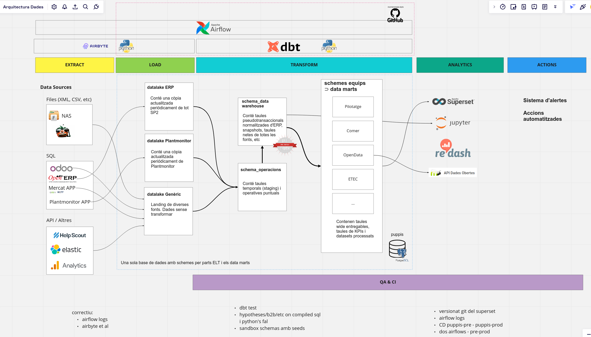

# somenergia-indicadors-KPIs

## Context

This repository aims to establish a data-driven pipeline for coooperatives of the Solidarity Economy Network of Catalonia (Xarxa d’Economia Solidària de Catalunya - XES)

### Data pipeline and warehouse schema

The general schema proposal to date



### Extractors and Loaders (EL)

Currently it is necessary to centralize data from different sources to consult with a data visualization application, also to have them in a standardized format. Some of the sources are non-standard and particular to the energy sector.

The extractor part of is tool is used to obtain data from different data sources, store it in a raw format and then load the data for transformation.

There are two modules, the datasources and the pipeline:

- Datasources: extracts through crawlers and saves raw data in a database.

- Pipeline: from the raw data it makes the transformation and performs the most complex operations


## Install using `virtualenvwrapper`

The following commands require `virtualenvwrapper`.

```sh
mkvirtualenv dades
pip install -r requirements.txt
cp dbconfig.example.py dbconfig.py
```

## Install using `pyenv`, `pipx` and `poetry`

The following commands require `pyenv`, `pipx` and `poetry`.

### Quickstart

Assuming `poetry` and `pyenv` are already installed, you can install the dependencies with the following commands:

```sh
pyenv install 3.8.12
pyenv virtualenv 3.8.12 somenergia-kpis
pyenv activate somenergia-kpis
poetry install
```

Read the following sections for more details.

### Using `pyenv`

1. Install `pyenv` using [pyenv-installer](https://github.com/pyenv/pyenv-installer) and follow their instructions. Pay special attention to the following steps:
   1. Extending your `.bashrc` file, documented in [the pyenv-installer README](https://github.com/pyenv/pyenv#set-up-your-shell-environment-for-pyenv), so that `pyenv` is available in your shell.
   2. Install `pyenv` dependencies for installing python versions as per the [pyenv wiki](https://github.com/pyenv/pyenv#install-python-build-dependencies)
2. Install the required python version with `pyenv install 3.8.12`, and wait until it finishes.
3. Create a new virtual environment of your choice. If you used `pyenv-installer` you should be able to create one with `pyenv virtualenv 3.8.12 somenergia-kpis`. Here, `somenergia-kpis` is the name of the virtual environment.
4. Activate the virtual environment with `pyenv activate somenergia-kpis`. Alternatively, you can use `pyenv shell somenergia-kpis` to activate the virtual environment for the current shell session. You can also set the python version locally with `pyenv local somenergia-kpis`. This will create a file called `.python-version` which is used by pyenv to automatically activate the virtual environment when you `cd` into the directory.

### Using `pipx`

`pipx` acts as a global interface to pip, meant to consume and install python packages that expose CLIs e.g. `poetry`. To install it, follow their instructions at [their documentation](https://pypa.github.io/pipx/installation/) to install `pipx`.

### Using `poetry`

Follow the instructions in [their documentation](https://python-poetry.org/docs/#installation) to install `poetry`. If you have `pipx` installed, you can install it with `pipx install poetry`. You can read more about this in their [installation documentation for `pipx`](https://python-poetry.org/docs/#installing-with-pipx).

#### Managing the environment with `pyenv` and dependencies with `poetry`.

At the root level of the repository you will find a [poetry.toml](./poetry.toml) file with some configurations that are valid at the **project level only**. More specifically,

```toml
[virtualenvs]
in-project = false
create = false
```

the `poetry.toml` tells `poetry` to not create a virtual environment for the project, and will instead use the virtual environment created with `pyenv`. 

This means that if you have the environment activated, you can now use the `poetry` CLI to manage dependencies.

#### Adding dependencies

`poetry add <package-name>` will add the package to the `pyproject.toml` file. You can also add a package as a development dependency with `poetry add --group dev <package-name>`. You can read more about this in the [poetry documentation](https://python-poetry.org/docs/cli/#add).

#### Exporting `pyproject.toml` to `requirements.txt`

This will export the dependencies listed in `pyproject.toml` to `requirements.txt` and `requirements-dev.txt` files. This is useful for deployment in production environments. Read more about this in the [poetry documentation](https://python-poetry.org/docs/cli/#export).

```sh
poetry export -f requirements.txt --only main --output requirements.txt --without-hashes
```

for development dependencies:

```sh
poetry export -f requirements.txt --only dev --output requirements-dev.txt --without-hashes
```


## Database configuration

Edit `dbconfig.py` with your data. You will have to create a database.

The visualization user has to have access to new tables by default, because some scripts replace the table each day. You can set this with:

```
ALTER DEFAULT PRIVILEGES IN SCHEMA public
GRANT SELECT ON TABLES TO username;
```

### transformations using dbt

```sh
$ pip install dbt-postgres
$ dbt init
```
Edit the ~/.dbt/profiles.yml with your connection details. You can use dbt_profile.exemple.yml as an example.
Set the schema to your user as `dbt_<name>`

## dbt dependencies

The dbt_utils macro `unpivot` requires dbt_utils macros, which can be installed with

```bash
dbt deps --project-dir dbt_kpis
```

## run

`python main.py --help` or `python main.py --list-functions`

### dbt

`$ dbt run --target testing --project-dir dbt_kpis`

## test

Testing will require installing `b2btest` which in turn requires `lxml` to be installed manually via pip

Create an empty testing database and configure it in dbconfig.py at the `test_db` entry.

`$ dbt test --target testing --project-dir dbt_kpis`


