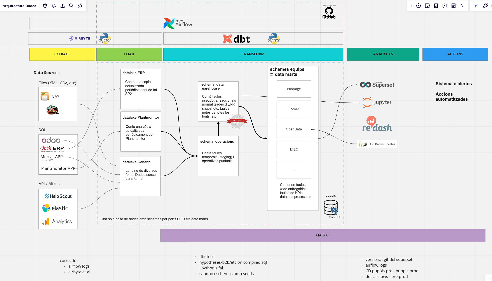

# somenergia-indicadors-KPIs

## Context

This repository aims to establish a data-driven pipeline for coooperatives of the Solidarity Economy Network of Catalonia (Xarxa d’Economia Solidària de Catalunya - XES)

### Data pipeline and warehouse schema

The general schema proposal to date



### Extractors and Loaders (EL)

Currently it is necessary to centralize data from different sources to consult with a data visualization application, also to have them in a standardized format. Some of the sources are non-standard and particular to the energy sector.

The extractor part of is tool is used to obtain data from different data sources, store it in a raw format and then load the data for transformation.

There are two modules, the datasources and the pipeline:

- Datasources: extracts through crawlers and saves raw data in a database.

- Pipeline: from the raw data it makes the transformation and performs the most complex operations


## Install using `virtualenvwrapper`

The following commands require `virtualenvwrapper`.

```sh
mkvirtualenv dades
pip install -r requirements.txt
cp dbconfig.example.py dbconfig.py
```

## Install using `pyenv`, `pipx` and `poetry`

The following commands require `pyenv`, `pipx` and `poetry`. Install `pyenv` by following its [installation instructions](https://github.com/pyenv/pyenv?tab=readme-ov-file#installation). Install `pipx` and then `poetry` with `pipx install poetry`. You can read more about this in their [installation documentation for `pipx`](https://python-poetry.org/docs/#installing-with-pipx).

### Quickstart

Assuming `poetry` and `pyenv` are already installed, you can install the dependencies with the following commands:

```sh
# install the specified python version with pyenv
pyenv install <PYTHON_VERSION> 

# this will create a .python-version file with the specified version
pyenv local <PYTHON_VERSION> 

# this will install the dependencies specified in pyproject.toml and create a virtual environment for the project
poetry install 
```

Where `PYTHON_VERSION` is a version compatible with the one specified in the `pyproject.toml` file.

You should be able to access the project's CLI as in

```sh
$ somenergia-kpis-cli --help
Usage: somenergia-kpis-cli [OPTIONS] FUNCTION:{meff_update_closing_prices_day|
                           meff_update_closing_prices_month|omie_get_historica
                           l_hour_price|omie_update_latest_hour_price|omie_upd
                           ate_historical_hour_price|omie_get_historical_energ
                           y_buy|omie_update_energy_buy|neuro_update_energy_pr
                           ediction|hs_update_conversations|pipe_hourly_energy
                           _budget|pipe_omie_garantia}...

Arguments:
  FUNCTION:{meff_update_closing_prices_day|meff_update_closing_prices_month|omie_get_historical_hour_price|omie_update_latest_hour_price|omie_update_historical_hour_price|omie_get_historical_energy_buy|omie_update_energy_buy|neuro_update_energy_prediction|hs_update_conversations|pipe_hourly_energy_budget|pipe_omie_garantia}...
                                  Choose which function you want to run.
                                  [required]

Options:
  -v, --verbose                   Increase verbosity  [default: 2]
  -l, --list-functions            List available functions
  -s, --dry-run                   Show dataframes, but don't save to db
  --install-completion [bash|zsh|fish|powershell|pwsh]
                                  Install completion for the specified shell.
  --show-completion [bash|zsh|fish|powershell|pwsh]
                                  Show completion for the specified shell, to
                                  copy it or customize the installation.
  -h, --help                      Show this message and exit.
```

#### Exporting `pyproject.toml` to `requirements.txt`

This will export the dependencies listed in `pyproject.toml` to `requirements.txt` and `requirements-dev.txt` files. This is useful for deployment in production environments. Read more about this in the [poetry documentation](https://python-poetry.org/docs/cli/#export).

```sh
poetry export -f requirements.txt --only main --output requirements.txt --without-hashes
```

for development dependencies:

```sh
poetry export -f requirements.txt --only dev --output requirements-dev.txt --without-hashes
```

## Database configuration

Edit `dbconfig.py` with your data. You will have to create a database.

The visualization user has to have access to new tables by default, because some scripts replace the table each day. You can set this with:

```sql
ALTER DEFAULT PRIVILEGES IN SCHEMA public
GRANT SELECT ON TABLES TO username;
```

### transformations using dbt

```sh
pip install dbt-postgres
dbt init
```

Edit the ~/.dbt/profiles.yml with your connection details. You can use dbt_profile.exemple.yml as an example.
Set the schema to your user as `dbt_<name>`

## dbt dependencies

The dbt_utils macro `unpivot` requires dbt_utils macros, which can be installed with

```bash
dbt deps --project-dir dbt_kpis
```

## run

`python main.py --help` or `python main.py --list-functions`

### dbt

`$ dbt run --target testing --project-dir dbt_kpis`

## test

Testing will require installing `b2btest`, install it with

`$ poetry install --with dev`

and then you can run pytest. At the time of writing, not all tests passed anymore.

Since I was dealing with a ticket, I just made `pytest -k omie` work. :S

Create an empty testing database and configure it in dbconfig.py at the `test_db` entry.

`$ dbt test --target testing --project-dir dbt_kpis`
