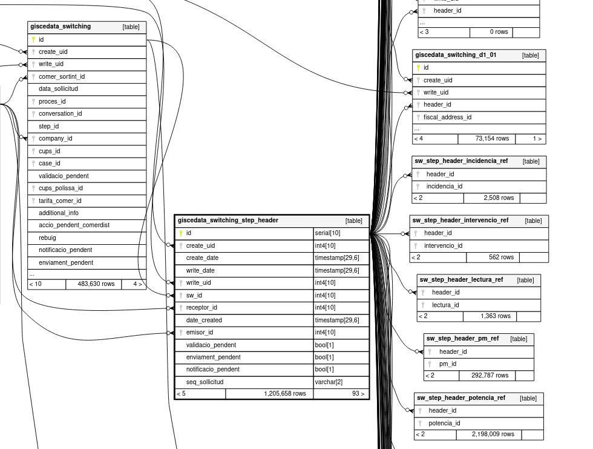

# Demanda d'anàlisi d'autoconsums encallats per la Generalitat

Per una trobada amb la Generalitat sobre els tràmits d'autoconsum, l'Hermínia ens va demanar un anàlisi de l'estat dels tràmits de contractes amb auto compartida.

[Context de helpscout](https://secure.helpscout.net/conversation/2183268143/14395835/)

Contractes amb auto subjectes d'anàlisi:

- [42] - Con excedentes y compensación Colectivo– Consumo
- [43] - Con excedentes y compensación Colectivo a través de red– Consumo

El codi sql _analyse_ de dbt es troba a [dbt_kpis](https://github.com/Som-Energia/somenergia-kpis/blob/main/dbt_kpis/analyses/dades_auto_generalitat_via_d1s.sql)

## Necessitat 1

- Nº de contractes amb una M cap a auto 42 i 43, en estat tancat,
i que en el contracte no aparegui autoconsum actiu.


via erpclient:

 cups_iniciats = cerquem tots els cups que en algun moment han fet un tramit d'auto coŀlectiu:

```
tots els casos
> 'Informació adicional': '-> 42;' i 'Proces': M i 'estat': 'tancat'
> 'Informació adicional': '-> 43;' i 'Proces': M i 'estat': 'tancat'
```

 cups_auto_col = cercar a totes les polisses: auto 42 i a totes les polisses: auto 43
 cups_sense = cups_iniciats - cups_auto_col

fent-ho a través de la base de dades, quedaria així 

``` sql
{!../dbt_kpis/analyses/dades_auto_generalitat_via_switching_finalitzats.sql!}
```

Per la necessitat 2, més tard hem descobert que podiem fer servir la mateixa tècnica però seleccionant els que **si** que havien finalitzat. És una manera més senzilla i podeu saltar-vos tot el procés que hem seguit per fer l'anàlisi via d1s. Ho trobareu al [final de tot d'aquest document](#via-el-cas-de-switching).


## Necessitat 2

- Nº de contractes amb D101(04) coŀlectiu en pas 02 d'acceptació, sense M102 obertes i acceptades i que no tinguin autoconsum actiu en el contracte

Fem l'extracció de dades directament sobre la db de l'erp sp2.

Decidim fer els passos següents:

### 1. sw_d101 = llista de tots els casos de switching d101 amb motiu de canvi 04 i collectiu true

Són els casos notificats per les distris conforme aquell cups té una instal.lació d'auto colectiva

### 2. sw_d102_acceptats = llista de casos de switching d102 acceptats (rebuig = false)

`d1_02_accepted` : agafa tots els d1_02 que no han estat rebutjats

```sql
with d1_02_accepted as (
    select d102.*, ss.id, ss.sw_id
    from giscedata_switching_d1_02 as d102
    left join giscedata_switching_step_header as ss on ss.id = d102.header_id
    where rebuig = false
)
select *
from giscedata_switching_d1_01 as d101
left join giscedata_switching_step_header as ss on ss.id = d101.header_id
inner join d1_02_accepted as d102a on ss.sw_id = d102a.sw_id
where motiu_canvi = '04' and collectiu is True
```

Nosaltres comuniquem a la distri que la persona usuaria esta conforme amb les dades de l'instal.lació. La llista que ens queda son totes les peticions d'autoconsum collectiu de les que hem iniciat el tràmit.

### 3. pol_amb = cerca de totes les polisses amb auto collectiu sctiu

Ens servirà per a treure les polisses que la distri no s'ha esperat a tenir l'm1 al punt següent

`pol_amb`

```sql
    select *, ps.name as cups_name, ps.id as ps_id
    from giscedata_polissa as p
    left join giscedata_cups_ps as ps on ps.id = p.cups
    where autoconsumo ilike '43' or autoconsumo ilike '42'
```
### 4. pol_sense = sw_d102_acceptats - pol_amb polisses que han intentat autoconsum collectiu i no ho han aconseguit (encara)

`m101_col`

```sql
    select *
    from giscedata_switching_M1_01
    where tipus_autoconsum = '42' or tipus_autoconsum = '43'
```

### 5. m1_pol_sense_a = totes les m1 relacionades amb canvi a 42 o 43, de les polisses sense auto



* `d102_accepted` : agafa tots els d1_02 que no han estat rebutjats, que és el què sap si és autoconsum
* `d102_ac_accepted` : tots els d102 que son d'auto col.lectiu
* `pol_amb` : totes les polisses que tenen actiu autonconsum 42 o 43
* `pol_sense_a` : totes els d102 que no tenen polissa amb auto coŀlectiu actiu
* `m101_col`: m101 amb autoconsum coŀlectiu


* `query principal` : Tots els d102 amb autoconsum acceptat sense auto actiu a la polissa i que no tenen una M101

En `pol_sense_a` i a la `query principal` fan servir la construcció sql `left outer join`, que es fa amb un where `right.key is null`


fent els joins a switching basant-se en els m1:

```sql
with d102_accepted as (
        select ss.sw_id 
        from giscedata_switching_d1_02 as d102 
        left join giscedata_switching_step_header as ss on ss.id = d102.header_id
        where rebuig = false
    ),
    d102_ac_accepted as (
        select ps.name as cups_d1, ps.id as ps_id, distri.name as distri
        from giscedata_switching_d1_01 as d101
        left join giscedata_switching_step_header as ss on ss.id = d101.header_id
		left join giscedata_switching as sw on sw.id = ss.sw_id
		left join giscedata_cups_ps ps on ps.id = sw.cups_id
        inner join d102_accepted as d102a on ss.sw_id = d102a.sw_id
		left join giscedata_polissa as pol on ps.id = pol.cups
		left join res_partner as distri on distri.id = ps.distribuidora_id
        where motiu_canvi = '04' and collectiu is True and pol.state = 'activa'
    ),
    pol_amb as (
        select ps.name as cups_name
        from giscedata_polissa as p
        left join giscedata_cups_ps as ps on ps.id = p.cups
        where (autoconsumo ilike '42' or autoconsumo ilike '43') 
    ),
	pol_sense_a as (
        select sw.ps_id, cups_d1, distri
        from d102_ac_accepted as sw		
        left join pol_amb as p on sw.cups_d1 = p.cups_name
		where p.cups_name is null 
    ),
	m101_col as (
        select sw.cups_id, m1.id as m1_id, header_id, ss.id as ss_id, ss.sw_id
        from giscedata_switching_M1_01 as m1
    	left join giscedata_switching_step_header as ss on ss.id = m1.header_id
    	left join giscedata_switching as sw on sw.id = ss.sw_id
		where tipus_autoconsum = '42' or tipus_autoconsum = '43'
    )
    select cups_d1, ps_id, sw_id, ss_id
    from pol_sense_a as sa
	left join m101_col on m101_col.cups_id = sa.ps_id
    where m101_col.m1_id is null
order by cups_d1, sw_id, ss_id, ps_id desc
```

### 6. m2_pol_sense = totes les m2 relacionades amb canvi a 42 o 43, de les pol_sense

Reutilitzant pol_sense_a definit al pas anterior

`m102_col` : seleccionem les m102 que tenen un m101 de tipus autoconsum associat

```sql
with m101_col as (
    select *
    from giscedata_switching_M1_01 as m101
    left join giscedata_switching_step_header as ss on ss.id = m101.header_id
    where tipus_autoconsum = '42' or tipus_autoconsum = '43'
),
m102_col as (
    select sw.cups_id
    from giscedata_switching_M1_02 as m102
    left join giscedata_switching_step_header as ss on ss.id = m102.header_id
    left join giscedata_switching as sw on ss.sw_id = sw.id
    inner join m101_col as m101 on m101.sw_id = ss.sw_id
    where m102.rebuig = false
)
select cups_d1, ps_id
from m102_col
left join pol_sense_a as psa on psa.ps_id = m102_col.cups_id
order by cups_id
```

si enlloc d'això volem les polisses sense auto que NO tenen un m102, la query principal seria

``` sql
select *
from pol_sense_a as sa
left join giscedata_switching as sw on sw.cups_id = sa.ps_id
left join giscedata_switching_step_header as ss on ss.sw_id = sw.id
left join m102_col on m102_col.header_id = ss.id
where m102_col.id is null
```

La query final de la necessitat dos és, doncs:

D'aquesta query en direm `query_a` més endavant.

``` sql
{!../dbt_kpis/analyses/dades_auto_generalitat_via_d1s.sql!}
```

Aquesta query parteix dels d1 per a arribar als casos M. Una manera alternativa és partir dels casos de switching i fer servir l'additional_info.

### via el cas de switching

D'aquesta query en direm `query_b`

``` sql
{!../dbt_kpis/analyses/dades_auto_generalitat_via_switching_no_finalitzats.sql!}
```

Poden haver-hi diferències entre les dues queries perquè una 

- id_polissa = 312905: aquest surt amb la query_b pero no amb la query_a perque no té D1
- id_polissa = 93247: aquest surt amb la query_a pero no la query_b perque tot i tenir una 02 aceptada, tb te una 05.
- id_polissa = 146266: idem, hi ha un 02 acceptació pero hi ha tb un 04 (lo capta la query_a no la query_b)

# Queries que ens han estat útils en l'anàlisi

La query [estat_del_cas_de_giscedata_switching](https://github.com/Som-Energia/somenergia-kpis/blob/main/dbt_kpis/analyses/estat_del_cas_de_giscedata_switching.sql) agafa 6 processos de switching d'auto. 

També ha estat útil saber que giscedata_switching té informació tant del tipus de cas ATR, es a dir, M, C, D, etc (columna proces_id = giscedata_switching_proces) com del pas en el que es troba el cas ATR (columna step_id = giscedata_switching_step)

